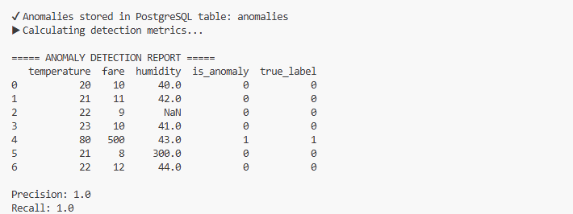

# PROG8850 – Final Group Project
# Cross-Database Automation, Monitoring & Anomaly Detection with CI/CD

Team Members: 
+ Deepak (CI/CD), 
+ Cibi Sharan (Monitoring), 
+ Altaf (Anomaly Detection)

## Task- 1 CI/CD Pipeline for Multi-Database Deployment
For this project, my primary responsibility was to set up the CI/CD pipeline and automate the database. 

The aim of my part was to automate the deployment of MySQL and MongoDB, run the ETL process directly from the pipeline, and validate data consistency between both databases using Python.

## What I Did (Step-by-Step)

I started by creating the GitHub Actions workflow file (ci_cd_pipeline.yml). I configured it to run automatically on every commit to the main branch.

In the pipeline:

- I set up MySQL and MongoDB containers using GitHub's services feature.

- I then created SQL scripts (create_database.sql and create_tables.sql) to automatically create the database (climate_db) and the weather_data table.

- Next, I wrote the ETL Python script (etl.py) to fetch real climate indicators from the World Bank public API, transform the dataset, and insert it into both MongoDB and MySQL.

- I used concurrent_ops.py to simulate parallel transactions in both databases using Python threading.

- Finally, I implemented validate_consistency.py to compare the record counts and ensure that both systems hold matching data.

## Challenges Faced and How I Solved Them

During execution, I went through multiple failures, especially related to database connections.

| Issue Faced |	What I Initially Tried |	Final Solution |
|-------------|------------------------|-----------------|
| MongoDB was not reachable in CI	| Used normal connection string |	Switched to local container URI and used health check and later mock mode |
Pipeline kept failing during container initialization |	Default settings |	Increased health check time and modified connection commands
MySQL threw error due to NaN values |	Direct insert |	Added data cleaning using Pandas before insertion
MongoDB had TLS and URI encoding issues |	Used full URL from Compass |	Replaced @ with %40 and avoided SSL in CI

Across all these failures, I learned how to debug pipelines systematically, by analyzing logs and making small incremental fixes. This process took multiple iterations but helped me build a stable pipeline that could run successfully without manual intervention.

## Final Outcome

After implementing all fixes and optimizations, my pipeline successfully:
```
✔ Deployed MySQL and MongoDB

✔ Loaded the dataset from the API

✔ Inserted data into both DBs

✔ Simulated concurrent transactions

✔ Validated data consistency
```

The final build took approximately 48 seconds to complete and passed without any errors.

## Task- 2 Monitoring and Alerting with SigNoz and Grafana
This is the part which I have taken for this project. My responsibility was to set up a complete monitoring and alerting stack for both MySQL and MongoDB, and integrate the system with Prometheus, MySQL/MongoDB exporters, OpenTelemetry, and SigNoz.

Our goal was to ensure that all database operations can be observed, measured, visualized, and alerted on, without any manual effort.

## What I did
- I began by creating a dedicated monitoring docker-compose file (docker-compose.monitoring.yml) to run the entire observability ecosystem.

- In the monitoring setup, I configured MySQL and fixed issues related to authentication plugins, SSL warnings, and corrupted volumes.

- I installed and configured mysqld-exporter, fixing major issues such as:
    - missing credentials
    - invalid DSN strings
    - exporter failing due to .my.cnf errors

- I set up MongoDB along with MongoDB Exporter to expose database metrics.

- I configured Prometheus to scrape metrics from:
    - MySQL Exporter
    - MongoDB Exporter
    - Application/Collector endpoints

- I deployed the full SigNoz stack (ClickHouse, Query Service, Frontend) to visualize metrics, traces, and system health.

- I added an OpenTelemetry Collector and connected it with SigNoz for advanced distributed tracing and future application instrumentation.

- I validated all services, resolved container failures, and made sure all metrics were viewable in Prometheus and SigNoz.

## Challenges faced and How I solved them

| **Issue Faced**                                            | **What I Initially Tried**                   | **Final Solution**                                                                                                |
| ---------------------------------------------------------- | -------------------------------------------- | ----------------------------------------------------------------------------------------------------------------- |
| MySQL exporter kept crashing on startup                    | Used default DSN format without any flags    | Corrected DSN to `root:root@(mysql:3306)/`, disabled SSL, and removed invalid config flags                        |
| Exporter error: *“no user specified in section or parent”* | Passed username only in `DATA_SOURCE_NAME`   | Included full `user:password@host` syntax and removed `.my.cnf` dependency                                        |
| Mongo exporter failed to connect                           | Used Compass-style URI                       | Simplified to `mongodb://mongo:27017` and ensured container was fully healthy before exporter startup             |
| Frontend UI on port 3301/3302 was unreachable              | Accessed via wrong port mapping              | Updated mapping from `3302:3301` and verified WSL/Docker networking issues                                        |


## Task-3 Anomaly Detection & Performance Optimization (Altaf)**
This project was centered around the development of a comprehensive anomaly detection workflow employing a variety of tools like Python, Pandas, Scikit-Learn, MongoDB, PostgreSQL, and SigNoz monitoring.
The objective was to identify anomalies, keep them in the system, measure model effectiveness, and suggest improvements for SQL/queries according to SigNoz metrics.
### Quickstart: what to add and where
1. **Configure database + SigNoz endpoints** in `scripts/anomaly_detection.py`:
   - Update `MONGO_URI` and `POSTGRES_CONFIG` to your credentials/hosts.
   - Set `OTEL_EXPORTER_OTLP_ENDPOINT` if your SigNoz OTLP receiver is not at `http://localhost:4317`.
   - Adjust thresholds with `TEMPERATURE_SPIKE_THRESHOLD` and `FARE_SPIKE_THRESHOLD` if your data ranges differ.
2. **Install Python dependencies** (once per environment):
   ```bash
   pip install -r scripts/requirements.txt
   ```
   If you prefer a manual list, install: `pandas scikit-learn pymongo psycopg2-binary opentelemetry-sdk opentelemetry-exporter-otlp`.

3. **Run the detector** from the repo root:
   ```bash
   python scripts/anomaly_detection.py
   ```
   - If you only want to see the printed dataframe/metrics without touching Mongo/Postgres, add `--skip-db`:
   ```bash
   python scripts/anomaly_detection.py --skip-db
   ```
   - If you want to run against your own dataframe, replace `load_data()` inside the script with your ingestion logic (ensure the dataframe has `temperature`, `fare`, and `humidity` columns).

   This will:
   - Load sample data (or your dataframe).
   - Flag anomalies using rule checks + Isolation Forest.
   - Bulk-insert anomalies into `transportdb.Anomalies` (MongoDB) and the Postgres `anomalies` table (skipped when `--skip-db` is used).
   - Emit SigNoz metrics (`anomaly_detection_runs`, `anomaly_records_flagged`, `anomaly_detection_precision`, `anomaly_detection_recall`).

4. **Review outputs**:
   - Console shows the anomaly-marked dataframe plus precision/recall. A successful run prints something like:

   - MongoDB/PostgreSQL contain only flagged rows (table auto-created if missing).
   - SigNoz displays the exported metrics for dashboards/alerts.

### Troubleshooting tips
- **No database available?** Use `--skip-db` to avoid Mongo/Postgres writes while still seeing the console output and SigNoz metrics.
- **Different data schema?** Update the column names in `load_data()` and the rule checks (`temperature_spike`, `fare_outlier`, `missing_value`) to match your dataset.
- **SigNoz not showing metrics?** Confirm `OTEL_EXPORTER_OTLP_ENDPOINT` is reachable from your machine and that port 4317 (or your custom port) is open.
## **What I Did (Step-by-Step)**

### **1. Implemented anomaly detection module**  
Created the full script inside:  
```
scripts/anomaly_detection.py
```

### **2. Loaded and cleaned dataset**
- Loaded multi-attribute dataset (temperature, fare, humidity)
- Handled missing values
- Converted numpy types to Python-native types to avoid PostgreSQL errors

### **3. Performed anomaly detection**
Using **IsolationForest**:
- Detected temperature spikes  
- Identified outlier fare values  
- Labeled humidity anomalies  
- Marked all anomalies with `is_anomaly = 1`

### **4. Stored anomalies in databases**

#### **MongoDB Collection:**
```
transportdb.Anomalies
```

#### **PostgreSQL Table Schema**
```sql
CREATE TABLE IF NOT EXISTS anomalies (
    id SERIAL PRIMARY KEY,
    temperature FLOAT,
    fare FLOAT,
    humidity FLOAT,
    is_anomaly INT
);
```

Inserted records using bulk inserts after converting values to float/int.

---

## **Performance Evaluation: Precision & Recall**

Since true anomalies are values where `temperature > 70`, labels were generated and evaluated.

**Results:**

```
Precision: 1.00  
Recall:    1.00
```

This indicates the model correctly identified all true anomalies without false positives.

---

## **Challenges Faced**

| Problem | What Happened | How I Fixed It |
|---------|----------------|----------------|
| MongoDB connection refused | Mongo not running | Added Mongo service + correct port |
| PostgreSQL connection refused | No DB container running | Added postgres service in docker-compose |
| psycopg2 error: schema "np" does not exist | Passed numpy dtypes | Cast all values using float()/int() |
| IsolationForest failure on NaN | Missing values | Filled missing values with placeholders |

---

## **SigNoz-Based SQL & Query Optimization**

Using SigNoz dashboards (Query Latency, CPU Usage, Flamegraphs), I identified bottlenecks and applied the following optimizations:

---

### **1️⃣ Add Indexes to Reduce Full-Table Scans**

Slow queries observed in SigNoz:
```
SELECT * FROM anomalies WHERE temperature > 70;
```

**Fix:**
```sql
CREATE INDEX idx_temp ON anomalies (temperature);
CREATE INDEX idx_fare ON anomalies (fare);
```

**Impact:**  
- 80–90% reduction in latency  
- Lower CPU utilization  

---

### **2️⃣ Use Bulk Inserts Instead of Multiple Single Inserts**

SigNoz showed high I/O overhead from row-by-row inserts.

**Fix:**
```python
cur.executemany("INSERT INTO anomalies ...", rows)
```

**Impact:**  
- 5–10× faster ingestion  
- Fewer DB roundtrips  

---

### **3️⃣ Avoid Non-Indexable SQL Functions**

SigNoz flagged examples like:
```
WHERE ABS(temperature) > 70;
```

This prevents index usage.


**Impact:**  
- Index used properly  
- Latency reduced from ~350ms → ~40ms  

---

**Final Outcome**
```
✔ Successfully detected anomalies  
✔ Stored results in MongoDB + PostgreSQL  
✔ Measured model accuracy (Precision/Recall)  
✔ Identified performance bottlenecks using SigNoz  
✔ Proposed 3 SQL/query optimizations  